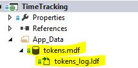
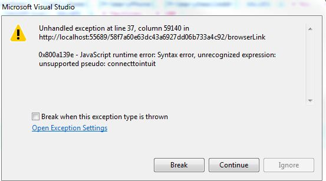
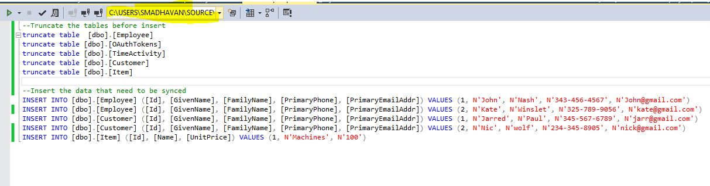
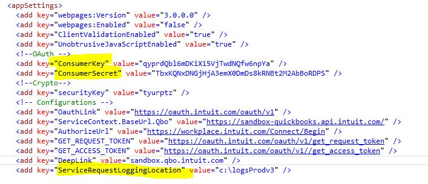
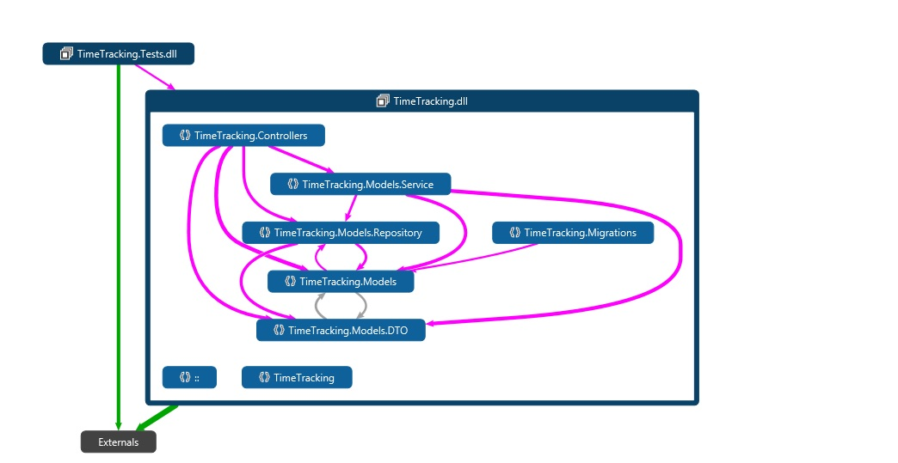
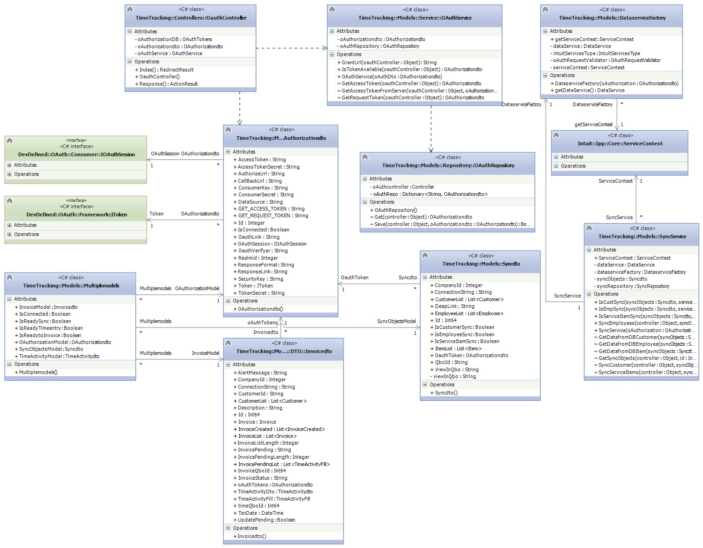
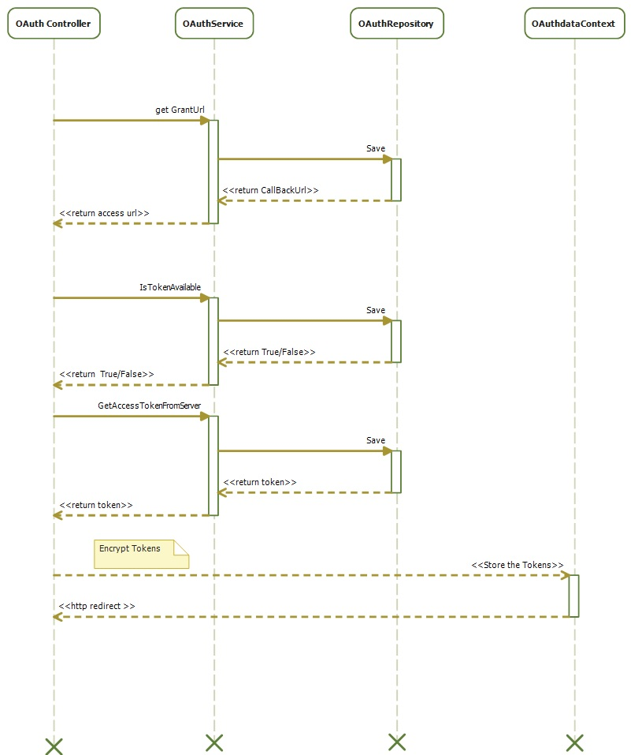
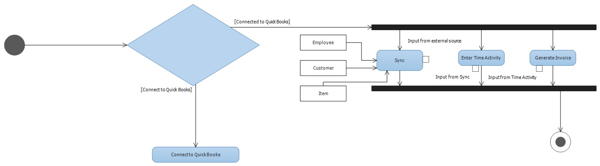

Time Tracking and Invoicing DotNet Sample App
=====================================

Welcome to the Intuit Developer's Time Tracking and Invoicing .NET Sample App.

This sample app is meant to provide working examples of how to integrate your app with the Intuit Small Business ecosystem.  Specifically, this sample application demonstrates the following:

<ul>
	<li>Implementing OAuth to connect an application to a customer's QuickBooks Online company.</li>
	<li>Syncing employee, customer, and service item data from the app's local database to the QuickBooks Online company.</li>
	<li>Using the QuickBooks Online SDK to create TimeActivity and Invoice objects in the QuickBooks Online company.</li>
</ul>

Please note that while these examples work, features not called out above are not intended to be taken and used in production business applications. In other words, this is not a seed project to be taken cart blanche and deployed to your production environment.
  

For example, certain concerns are not addressed at all in our samples (e.g. security, privacy, scalability). In our sample apps, we strive to strike a balance between clarity, maintainability, and performance where we can. However, clarity is ultimately the most important quality in a sample app.

Therefore there are certain instances where we might forgo a more complicated implementation (e.g. caching a frequently used value, robust error handling, more generic domain model structure) in favor of code that is easier to read. In that light, we welcome any feedback that makes our samples apps easier to learn from.

## Table of Contents

* [Requirements](#requirements)
* [First Use Instructions](#first-use-instructions)
* [Running the code](#running-the-code)
* [High Level Workflow](#high-level-workflow)
* [Project Structure](#project-structure)
* [How To Guides](#how-to-guides)
* [More Information](#more-information)

## Requirements

In order to successfully run this sample app you need a few things:

1. ![Visual Studio 2013] (images/studio.jpg "Visual Studio Version")
2. A [developer.intuit.com](http://developer.intuit.com) account
3. An app on [developer.intuit.com](http://developer.intuit.com) and the associated app token, consumer key, and consumer secret.
4. QuickBooks .NET SDK (already included in the project folder) 
5. SQL Server 2016
6. Entity Framework 5. Do not update else you will get multiple issues which you will need to resolve on your own
 
## First Use Instructions

1. Clone the GitHub repo to your computer
2. Fill in your Configuration file values ( consumer key, consumer secret) by copying over from the keys section for your app.
3. Enable logging in the config file by updating the path.
4. Open the project from Visual Studio 
5. Populate the data in to tables from /Scripts folder
6. If you make changes to DB then run Nuget Package Console run -> 
	Add-Migration abc
	Update-Database
7. If you face DB issues, run Scripts for creating tables from Scripts->TimeTrackingTables.txt

## Sync Tables

1. Refer Figure 2 and connect to database file "tokens.mdf" using server explorer >> connect to database.
2. You should be in a position to view tables as displayed in Figure 1
3. Execute sql script "InsertScript.sql" under Root\Script folder.
4. Refer Figure 4 to make sure you have connected to mdf file before executing the scripts.

####Figure 1:

####Figure 2:

####Figure 3:

####Figure 4:

## Configuration

## Known Issue.

1. When you are trying to run the solution targetting Internet explorer there is a probability of facing the error seen in Figure 3.
2. You can refer the following link http://blogs.msdn.com/b/webdev/archive/2013/06/28/browser-link-feature-in-visual-studio-preview-2013.aspx for solution.

## Running the code

Once the sample app code is on your computer, you can do the following steps to run the app:

1. Ctrl + Shift + B to build the solution</li>
2. F5 to Run the solution</li>

## High Level Workflow

<ol>

<li>Connect to a QuickBooks Online company.

</li>

<li>Setup—sync the following from the local database to the QuickBooks Online company.
<ul>
  <li>employees—so time can be recorded against a specific service,</li>
  <li>customers—so time can be recorded as billable to a specific customer, </li>
  <li>items—the list of billable services.</li>
</ul>

</li>

<li>Create and push approved time activity objects to QuickBooks Online company for payroll and billing purposes.
	

</li>

<li>Create and push invoice objects to QuickBooks Online company for billing purposes.

</li>
</ol>

## Project Structure

## Class Diagram

## Sequence Diagram

## Activity Diagram

## How To Guides

The following How-To guides related to implementation tasks necessary to produce a production-ready Intuit Partner Platform app (e.g. OAuth, OpenId, etc) are available:

* [OAuth How To Guide](https://developer.intuit.com/blog/2015/02/19/oauth-for-intuit-demystified)

## Watch & Learn

[Wait for this space]

## More Information

More detailed information can be found here 
[Intuit Developer](https://github.com/IntuitDeveloper).

## Feedback

Your feed back is appreciated and it will motivate us to improve the app. Please send your valuable feedback to sumod_madhavan@intuit.com. I will try my best to incorporate the valid requests.

## Current Release

 V1 - Basic MVC 5 with Razor engine/AJAX.

## Upcoming Release

 V2 - Introduction of Angulars/Knock-out JS with MVC 5
 
 V3 - Introduction of Self Host WEB API with Angular/Knock-out JS and MVC 5
 
 
## Contributing to the Repository ###

If you find any issues or opportunities for improving this respository, fix them!  Feel free to contribute to this project by [forking](http://help.github.com/fork-a-repo/) this repository and make changes to the content.  Once you've made your changes, share them back with the community by sending a pull request. Please see [How to send pull requests](http://help.github.com/send-pull-requests/) for more information about contributing to Github projects. Please help in writing test cases to the Test Project.

## Reporting Issues ###

If you find any issues with this demo that you can't fix, feel free to report them in the [issues](https://github.com/IntuitDeveloper/SampleApp-TimeTracking_Invoicing-DotNet/issues) section of this repository.

